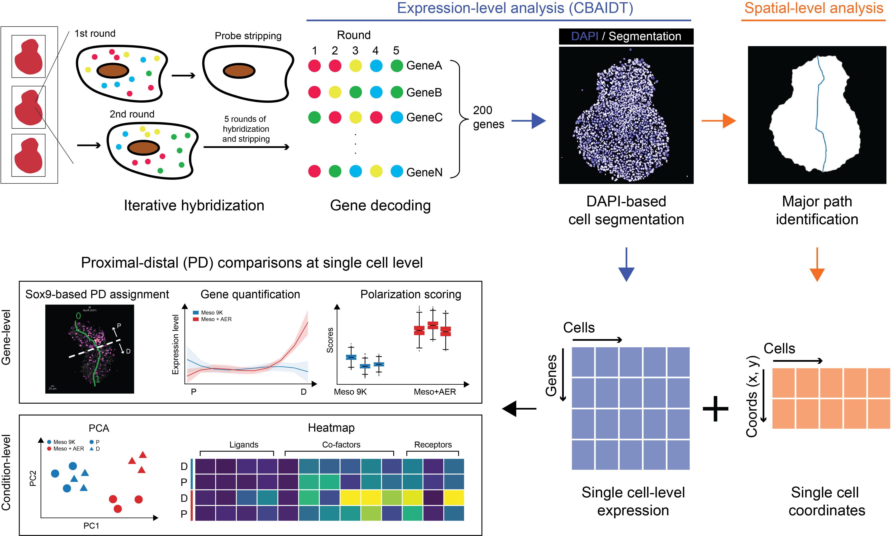

# COOLNAME -- Spatially quantify gene expression
*COOLNAME* allows comparison of the spatial dynamics and polarization of gene profiles across budoids of varying sizes. A more detailed description of the method can be found in [our paper](https://doi.org/).

#


## Installation
Create and activate a fresh conda environment:

```console
conda create -n COOLNAME python=3.9
conda activate COOLNAME
```

Finally, install `COOLNAME`:

```console
git clone https://github.com/AztekinLab/coolname.git
cd coolname
pip install .
```


## Usage
Please see the [documentation](https://coolnameaztekin.readthedocs.io/en/latest/) for full explanation.

### Quick start
```console
python example.py --dir ./Budoid_1A --sample Budoid_1A
```
